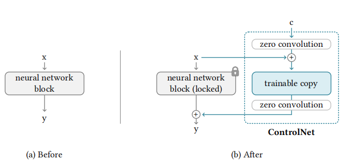
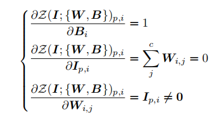
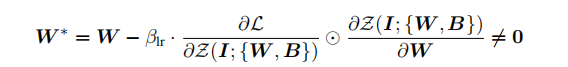
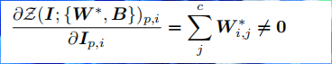
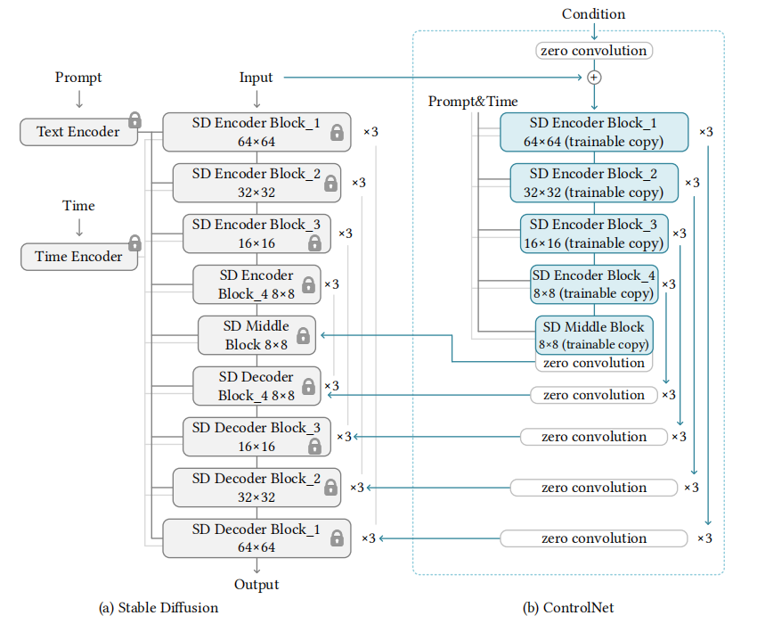
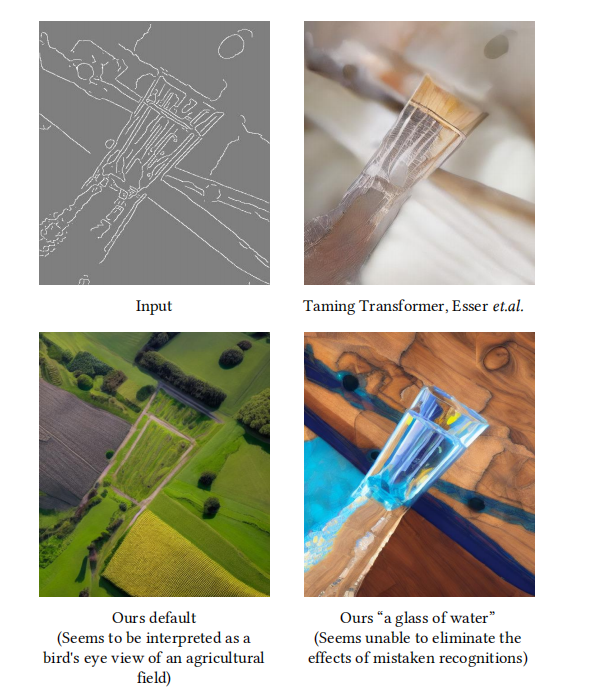

# Adding Conditional Control to Text-to-Image Diffusion Models

## 1.概述

本文提出了一个神经网络结构，ControlNet，通过输入条件控制大型预训练扩散模型的输出。
我们发现，通过使用ControlNet 可以对大规模扩散模型（Stable Diffusion）进行增强，例如输入边缘图，分割图，关键点等，这些能丰富控制大规模扩散模型的使用及应用。

ControlNet将大规模扩散模型的权重复制成两份，一份是可训练副本，一份是锁定副本。

锁定副本保留从数十亿图片中学到的网络能力，可训练副本在特定数据集上进行训练用于学习条件信息。

锁定副本跟可训练副本通过零卷积的独特卷积层连接在一起。

我们使用不同的condition数据集，包括Canny deges，Hough lines，用户涂鸦，人体关键点，分割图等训练处不同的ControlNet。

## 2.背景介绍

### 2.1 HyperNetwork

HyperNetwork是一种神经语言处理方法，该方法通过训练一个小的RNN来影响一个大的神经网络。
ControlNet与HyperNetwork类似,使用了零卷积层影响神经网络的行为。

### 2.2 扩散模型

扩散模型刚开始在小尺寸图像生成上取得了成功的结果。在高分辨率图片生成时，为了及节省算力，使用了潜在扩散模型，这些方法基本使用U-net作为神经网络架构。

### 2.3 文本图像生成扩散模型

扩散模型可以应用于文本到图像的生成任务，通常使用预训练语言模型CLIP将文本输入编码为潜在向量。例如Stable Diffusion 是一个大规模基于潜在扩散模型的实现，完成文本到图像的生成。

### 2.4 个性化，定制化，控制预训练扩散模型

由于最先进的图像扩散模型被文本到图像的方法主导，增强对扩散模型控制的最直接方法是通过文本引导。这类控制通常基于CLIP特征。

图像扩散过程本身也能提供一些功能实现色彩级别的细节变化。

### 2.5 图像到图像的转化

虽然ControlNet和图像到图像的转化可能有一些重叠应用，但它们的动机本质上不同。图像到图像的转化旨在学习不同领域图像之间的映射关系，而ControlNet旨在用特定的任务条件来控制扩散模型。

## 3.方法

### 3.1 ControlNet

ControlNet 通过控制神经网络块的输入条件，进一步控制整个神经网络的行为。
如图(a)所示，给定一个特征图 $x \in R^{h \times w \times c}$ ,神经网络块为 $F(.;\Theta)$, 则输出可表示为：
$u = F(x;\Theta)$。

我们锁住 $\Theta$ 中的权重，制作副本 $\Theta_c$。$\Theta_c$ 使用额外的条件向量 $c$ 进行训练。

制作副本而不是直接训练原始权重的动机是避免在小数据上出现过拟合，而且保留了从数十亿图片学习到可供生成环境的大模型。

这两个神经网络块通过零卷积（ $1\times1$ 的卷积核，权重和偏置均为0）进行连接。我们将零卷积操作标记为 $Z(.;.)$。

$y_c = F(x;\Theta) + Z(F(x+Z(c;\Theta_{z1};\Theta_c));\Theta_{z2})$

由于零卷积初始化为权重，偏置均为0。因此第一个训练step为 $y_c = y$。

以上公式表明，在任何优化之前,将ControlNet加在神经网络块之前 不会对原有的神经网络块产生任何影响。原有神经网络块的能力，功能，结果质量都将会完美保留。任何进一步的优化就会像微调一样快（与从头训练这些层相比）。

我们推导一下零卷积层的梯度计算, $W$ 为零卷积层的权重， $B$为偏置， $I$ 为输入特征。

$Z(I;{W,B})_{p,i} = B_i + \sum_j^cI_{p,i}W_{i,j}$。
初始状态下$W=0, B=0, I_{p,i} \ne 0$。因此梯度为

虽然零卷积会导致对特征 $I$梯度为0，但是对权重和偏置的梯度不受影响。只要特征 $I$ 不为0，权重 $W$ 就会在第一次梯度下降优化中变为非0矩阵。特征项来自于输入数据或者条件变量，因此自然保证为非零。权重 $W$ 在梯度更新过程中的公式为：

在第一个step 梯度下降之后 ，

因此零卷积层成为一种特殊的连接层，从零逐渐增长。

### 3.2 ControlNet in Image Diffusion Model

Stable Diffusion 是一个在数十亿张图片上训练的大型文本到图像的扩散模型。该模型骨架上是一个U-net，包括编码器、中间块和跳过连接的解码器。
编码器和解码器各有12个block，完整模型共有25个块（包括中间块）。在这些25个block中，8个block是下采样或者上采样，17个是主block，每个block包含4个resnet层和2个ViT。每个ViT包含多个交叉注意力或者自注意机制。文本编码器为OpenAI CLIP， 扩散模型时间step使用位置编码。

Stable Diffusion 使用了与VQ-GAN类似的预处理方法，将 $512 \times 512$ 的图像转化为 $64 \times 64$ 的潜在图像，以实现稳定的训练。这需要使用ControlNet将基于图像的条件转化为 $64 \times 64$ 的特征空间，以匹配卷积大小。

我们使用一个由四个卷积层组成的微型网络 $\epsilon$， 其卷积核为 $4 \times 4$， stride 为 $2 \times 2$，将图像空间条件转化为特征图

$c_f = \epsilon(c_i)$。

如图3所示，我们使用ControlNet来控制没一层的U-Net。具体来说，我们用ControlNet创建了12个编码块和1个中间块的可训练副本。它们的输出与Unet的12个跳过连接块和1个中间块相加。

### 3.3 训练过程

图像扩散模型能够学习逐渐去噪图像以生成样本。去噪可以在像素空间或者在潜在空间，Stable Diffusion 使用潜在图像作为训练域。

给定一个图像 $z_0$，扩散算法逐渐向图像中添加噪音，生成带噪音的图像 $z_t$。其中 $t$ 表示添加噪音的次数。当 $t$ 足够大的时候，图像近似于纯噪音。

给定一组条件，包括时间步长 $t$, 文本提示 $c_t$, 任务特定条件 $c_f$, 图像扩散算法学习一个网络 $\epsilon_\theta$ 来预测添加到 $z_t$ 中的噪音。学习目标函数为：

$L = E_{z_0, t, c_t, c_f, \epsilon \sim N(0,1)}[||\epsilon - \epsilon_\theta(z_t, t, c_t, c_f)||^2_2]$

其中 $L$是整个扩散模型的总体学习目标。这个学习目标可以直接用于微调扩散模型。
在训练过程中，我们随机替换50%的文本提示$c_t$为空字符串。这有助于ControlNet从输入条件映射中识别语义内容，例如Canny边缘映射或人类涂鸦等。这主要是因为当SD模型看不到提示时，编码器倾向于从输入控制映射中学习更多的语义作为提示的替代品。

### 3.4 改进训练

我们讨论了几种改进ControlNets训练的策略，特别是在计算设备非常有限（例如笔记本电脑）或非常强大（例如具有大规模GPU的计算集群）的极端情况下。

小规模训练：当计算设备受限时，我们发现部分断开ControlNet和稳定扩散之间的连接可以加速收敛。默认情况下，我们将ControlNet连接到“SD Middle Block”和“SD Decoder Block 1,2,3,4”，如图3所示。我们发现，断开连接到解码器1、2、3、4的链接，仅连接中间块，可以将训练速度提高约1.6倍（在RTX 3070TI笔记本GPU上测试）。当模型显示出合理的结果和条件之间的关联性时，可以在继续训练时重新连接这些已断开的链接，以便促进准确的控制。

大规模训练：在这里，大规模训练指的是同时拥有强大的计算集群（至少8个Nvidia A100 80G或等效设备）和大规模数据集（至少100万个训练图像对）的情况。这通常适用于数据容易获得的任务，例如由Canny检测的边缘图。在这种情况下，由于过拟合的风险相对较低，我们可以先对ControlNets进行足够多次的迭代训练（通常超过50k步），然后解锁稳定扩散的所有权重，并将整个模型作为一个整体进行联合训练。这将导致更具问题特异性的模型。

### 3.5 实现

我们提出了多种基于图像的条件控制大规模扩散模型的实现方法。

* Canny 边缘
* Canny 边缘（变种）
* Hough Line
* HED Boundary
* 用户草图
* 人体姿势 (Openpifpaf)
* 人体姿势 (Openpose)
* 语义分割 (COCO)
* 语义分割 (ADE20K)
* Depth (large-scale)
* Depth (small-scale)
* Normal Maps
* Normal Maps (extended)
* Cartoon Line Drawing

## 4.实验

本文中的所有结果均使用CFG-scale 9.0进行实现。采用DDIM采样器，缺省情况下使用20个步骤。我们使用三种类型的提示来测试模型：

（1）无提示：我们使用空字符串“”作为提示。

（2）默认提示：由于稳定扩散本质上是通过提示进行训练的，因此如果没有提示，空字符串可能会成为模型的意外输入，并且SD倾向于生成随机纹理映射。更好的设置是使用无意义的提示，如“一张图片”、“一张好看的图片”、“一张专业的图片”等。在我们的设置中，我们使用“一张专业、详细、高质量的图片”作为默认提示。

（3）自动提示：为了测试完全自动化管道的最优化质量，我们还尝试使用自动图像字幕方法（例如BLIP [34]）使用“默认提示”模式获得的结果来生成提示。我们将生成的提示再次应用于扩散。

（4）用户提示：用户提供提示。

## 5.局限性

当语义解释错误时，模型可能难以生成正确的内容

