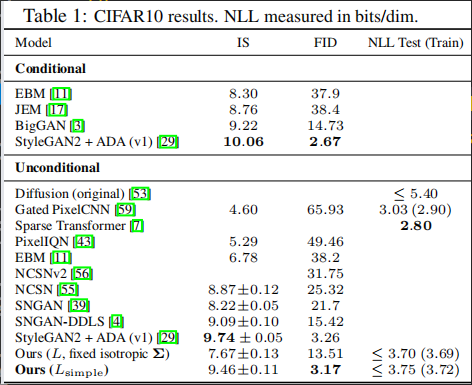

# Denoising Diffusion Probabilistic Models (DDPM)

## 1. 前言

GANs，自回归模型，flows，VAE在图像生成，音频生成领域取得了引人瞩目的效果。基于能量的模型已经在图像生成领域已经能与GANs媲美。

扩散模型是一个参数化的马尔科夫链，能够在有限时间生成与原始数据匹配的样本。

扩散过程是一个马尔科夫链，逐渐在原始数据上增加噪音，直到原始信号被破坏。扩散过程的逆过程可以被学习，用来将扩散过程逆转，生成原始数据。

扩散模型易于定义且容易训练。在本文之前，没有证据表明扩散模型能够生成高质量样本，本文正常扩散模型能够生成高质量的样本，有时还会优于其他类型的生成模型的效果。

## 2. Diffusion models 和 denosing autoencoders

### 2.1 正向过程和 $L_T$

正向过程是一个马尔科夫链，逐步在真实数据中加高斯噪音，直到真实数据变成噪音。

$q(X_{1:T}|X_0) := \prod_{t=1}^{T}q(X_t|X_{t-1})$

$q(X_t|X_{t-1}) := N(X_t; \sqrt{1-\beta_t}X_{t-1}, \beta_tI)$

训练过程通过优化负对数似然的变分界限

$E[-logp_\theta(x_0)] \leq E_q[-log\frac{p_\theta(X_0:T)}{q(X_{1:T|X_0})}] = E_q[-logp(X_T) - \sum_{t\geq1}log\frac{p_\theta(X_{t-1}|X_t)}{q(X_t|X_{t-1})}] := L$ 

前向过程中的 $\beta_t$ 是一个超参数常量。当 $\beta_t$ 很小的时候，正向过程跟逆向过程的方程非常类似。

我们令 $\alpha_t = 1-\beta_t$ , $\bar\alpha_t := \prod_{s=1}^t$, 就得到了 $q(X_t|X_0) = N(X_t;\sqrt{\bar\alpha_t}X_0, (1-\bar\alpha_t)I)$

正向过程中的 $\beta_t$ 是一个常量。$q$ 没有可学习的参数，因此 $L_T$ 在训练过程中是个常量，可以忽略。

### 2.2 逆扩散过程 和 $L_{1:T-1}$

逆扩散过程是一个包含已学习高斯变换的马尔科夫链，能够从噪音中恢复真实数据。初始状态为 $p(X_T) = N(X_T;0,I)$。

$p_\theta(X_0:T) := p(X_T) \prod_{t=1}^{T} p_\theta(X_{t-1}|X_t)$

$p_\theta(X_{t-1}|X_t) := N(x_{t-1};\mu_\theta(X_t,t), \sum_\theta(x_t, t))$

$\mu_\theta = \frac{1}{\sqrt{\alpha_t}}(X_t - \frac{\beta_t}{1-\alpha_t}\epsilon_\theta(X_t, t))$

参数重整化 $y = \mu(x) + \sigma(x) * z, z \sim N(0, 1)$

直接采样出 $N \sim X(\mu, \theta^2)$ 会比较困难，选择先从 $N \sim X(0, 1)$ 采样，再进行参数重整化，得到 $N \sim X(\mu, \theta^2)$

### 2.3 目标函数

$L_t = ||\epsilon - \epsilon_\theta(X_t,  t) ||^2 = ||\epsilon - \epsilon_\theta(\sqrt{\bar\alpha_t}X_0 + \sqrt{(1-\bar\alpha_t)}\epsilon, t)||^2$

神经网络的学习参数是 $\epsilon_\theta$

### 2.4 训练过程

* repeat
* $\quad x_0 \sim q(X_0)$
* $\quad t \sim Uniform({1,...,T})$
* $\quad \epsilon \sim N(0, 1) $
* 梯度下降

   $\quad \Delta_\theta||\epsilon - \epsilon_\theta(\sqrt{\bar\alpha_t}X_0 + \sqrt{1-\bar\alpha_t}\epsilon, t)||^2$
* 直到收敛

### 2.5 采样过程

* $X_T \sim N(0, 1)$
* for t=T,...,1 do
* $\quad z \sim N(0, 1)\quad  if \quad  t \gt 1, else\quad z=0$
* $\quad x_{t-1} = \frac{1}{\sqrt{\alpha_t}}(X_t - \frac{1-\alpha_t}{\sqrt{1-\bar\alpha_t}}\epsilon_\theta(X_t, t)) + \sigma_tZ$
* end for
* return $X_0$

## 4. 实验

实验中设置T为1000，正向过程中的 $\beta$ 是一个常量， $\beta_1$ 到 $\beta_T$ 的取值为 $10^{-4}$ 到 $0.02$。

相对于数据的范围为[-1,1],这些常数通常设置的很小，保证反向和正向过程的函数形式大致相同,同时保证 $X_T$处的信噪比尽可能的小。

反向过程，我们使用U-Net作为骨干网络，参数跨时间共享。网络使用sin position embedding。

实验结果如图所示

## 5. 结论

我们的研究表明，使用扩散模型能够生成高质量的图片。
