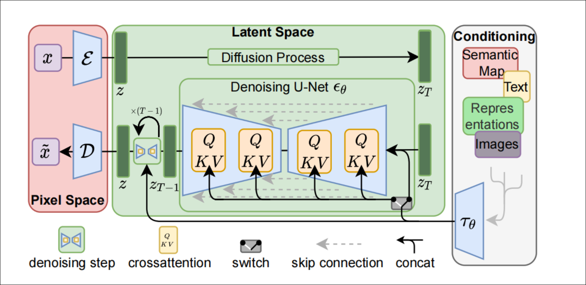

# High-Resolution Image Synthesis with Latent Diffusion Models

## 1.背景

图像合成是近期计算机视觉领域取得显著进展之一，但也是对计算资源需求最高的领域，尤其是复杂，自然场景的高分辨率合成。
GANs 模型由于数据具有相对有限的变异性，即生成的图片多样性不足。
基于似然函数的扩散模型，不会出现GANS的训练不稳定性，通过大量参数共享，能够模拟自然图像的高度复杂的分布。

扩散模型基于似然模型，需要大量的计算资源，训练强大的扩散模型通常需要数百个GPU天。因此需要一种方法来降低大模型的计算复杂度，降低对资源的消耗。

训练分为两个阶段：

1. 训练一个自编码器，提供一个低纬度的表征空间，该空间在感知上等价于数据空间。

2.在潜在空间上训练扩散模型，该空间具有更好的空间维度比例特性。

## 2.方法

### 2.1 感知图像压缩

更具体地，给定一个 RGB 空间中的图像 x ∈ R，H×W×3，
编码器 E 将 x 编码为潜在表示 z = E(x)，解码器 D 从潜在表示中重构图像，得到 ˜x = D(z) = D(E(x))，其中 z ∈ R
h×w×c。
编码器将图像下采样 f 倍，其中 f = H/h = W/w。

### 2.2 潜在扩散模型

扩散模型是一种概率模型，通过逐步去噪一个正态分布变量来学习数据分布p(x)，这相当于学习长度为T的固定马尔可夫链的反向过程。

对于图像合成，最成功的模型依赖于p(x)的变分下界的加权变体，这与去噪得分匹配类似。这些模型可以解释为等权序列的去噪自编码器θ(xt,t); t = 1...T，它们被训练成预测其输入xt的去噪变体，其中xt是输入x的噪声版本。

相应的目标函数可以表示为

通过我们训练好的感知压缩模型E和D，我们现在可以访问一个高效的低维潜在空间，在这个空间中，高频、难以察觉的细节被抽象化了。

与高维像素空间相比，这个空间更适合基于似然的生成模型，因为它们现在关注数据的重要语义位,在计算上更有效的低维空间训练。

### 2.3 条件机制

扩散模型能够对p(z|y)的条件分布进行建模。这可以通过一个条件去噪自编码器 θ(zt,t,y) 来实现，并为通过输入 y （例如文本、语义地图或其他图像到图像的翻译任务）控制合成过程。

我们在扩散模型的基础上增加交叉注意力机制，将其转化为更灵活的条件图像生成器。

为了预处理来自各种模态（例如语言提示）的y，我们引入一个特定领域的编码器 $\tau_\theta$, 将 y 投影到一个中间表示 $\tau_\theta \in R^{M \times d_\tau}$， 然后通过实现 $Attention(Q,K,V) = softmax(\frac{QK^T}{\sqrt{d}}) \cdot V$ 的交叉注意层，将其映射到UNet的中间层。
其中：

$Q=W_Q^{(i)} \cdot \varphi_i(z_t), K=W_K^{(i)} \cdot \tau_\theta(y), V=W^{(i)}_V\cdot\tau_\theta(y)$

因此损失函数为

## 3.实验

## 4.结论
