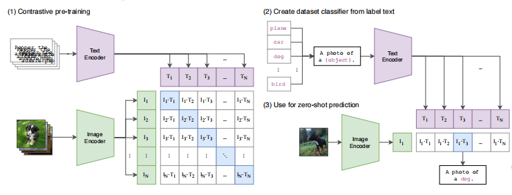
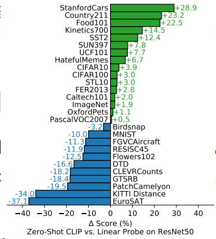

# Learning Transferable Visual Models From Natural Language Supervision

## 1. 引言

直接从原始文本中学习的预训练方法在过去几年彻底改变了NLP。这样训练出来的模型不用在特定下游任务上进行训练就能得到不错的效果。

但是在计算机视觉领域，预训练的标准做法依然是使用标记的数据集，例如ImageNet。

我们创建了一个包含4亿对（图像-文本）数据集，表明CLIP(Contrastive Language-Image Pre-training,)能够有效的从自然语言的监督中学习。我们发现CLIP与GPT类似，能够在多个任务上去的较好的性能，例如 OCR，地理定位，动作识别等。

## 2. 方法

### 2.1 自然语言监督

我们方法的核心是从包含自然语言的学习感知。从自然语言中学习有以下几个优势：

* 区别与标准的基于标签的图像分类，从自然语言中学习扩大数据集更容易。
* 与无监督或自监督学习相比，从自然语言中学习不只学习表征，而是将表征与语言联系起来。从而很容易做zero-shot的迁移学习。

### 2.2 创建足够大的数据集

我们创建了4亿个图像文本对的数据集，数据集被称作WIT。

### 2.3 选择高效的预训练方法

我们最初的方法与VirTex类似，从头联合训练了图像CNN和 text Transformer，用于预测图像标题。但是在扩展的过程中遇到了困难，6300万参数的transformer 模型已经使用了RestNet-50图像编码两倍的计算量。

这个任务试图预测每张图片所附的准确文字。由于图像的描述种类繁多，该任务非常困难。最近在对比学习的领域的研究发现，对比学习能够比预测学习学到更好的图像特征。我们提出了一个训练系统，仅预测哪个文本与图像相匹配而不是根据图像预测文本的确切单词，这样效率提高了4倍。

给定一个batch，包含N对（image，text）的数据，CLIP被训练用于预测 $N \times N$ 里面哪一个最有可能。
为此CLIP联合训练一个图像编码器和文本编码器，使用图像文本余弦相似度作为衡量分数，最大化N个正样本的分数，最小化 $N^2-N$ 个负样本的分数。使用交叉熵损失函数来优化这些分数。

### 2.4 选择和缩放模型

图像编码器使用了ResNet-50和ViT， 文本编码器使用了Transformer。

### 2.5 训练

图片编码器训练了8个模型，5个ResNet 和 3个Vision Transformer。5个ResNet 包括ResNet-50， ResNet-101，另外三个是根据Efficient-style 对ResNet-50的宽度，深度，输入大小进行scale，分别对应ResNet-50 的4倍，16倍，64倍的计算量。Vision Transformer 分别为ViT-B/32, ViT-B/16 和ViT-L/14。所有的模型训练了30个epoch，使用Adam优化器。

超参数使用grid search，random search，manual tuning来调整。ViT-L/14 在336分辨率数据集上fine-tune 了一个epoch，称作ViT-L/14@336，后面的CLIP均使用该模型。

## 3. 实验

### 3.1 Zero-Shot 迁移

在计算机视觉领域，zero-shot 学习，通常指的是在图像分类领域，能够泛化到不在训练数据集的类别。我们专注于研究zero-shot 迁移作为分类任务的重心，该灵感来自于NLP领域。

CLIP是个预训练模型，用于预测图像跟文本匹配。为了在图像分类上使用zero-shot,我们使用所有类别的名称作为潜在文本配对集合，基于CLIP预测与图片最匹配的文本。

我们首先利用图像编码器和文本编码器，计算图像的特征嵌入和候选文本集的特征嵌入。然后计算余弦相似度，再通过参数 $\t$ 扩大，正则化之后通过softmax计算概率分布。

为什么需要Prompt enginering 和 ensembling？ 一个原因是一词多义。另外一个原因是我们发现与图像配对的文本是一个词。通常来说文本是一个完整的句子，描述图片。为了弥补这个差距，我们使用了提示模板，"A photo of a {label}"。 该方法与仅适用标签文本，准确率提升了1.3%。

跟GPT-3讨论的prompt engineering类似，我们发现针对不同的任务定制prompt 模板，能够明显提升zero-shot 准确率。例如在Oxford-IIIT Pets数据集上，我们使用的prompt 模板是 "A photo of a {label}, a type of pet"。这样就缩小了解空间。

本文尝试集成多个zero shot classifier 来提高准确率。我们使用embedding 空间替换概率空间，我们缓存一系列prompt的均值，这样跟计算单个promt消耗一样。在ImageNet上，我们集合了80个不同的prompt 模板，这比单个默认的prompt 准确率提升了3.5%。

我们在27个数据集上对比了ResNet-50 与 zeor-shot CLIP的准确率，结果如下图所示
,CLIP在16个数据集上的效果打败了ResNet-50。

CLIP在通用分类数据集上，例如ImageNet，CIFAR10/100, STL10,PascalVOC2007 更具优势。而在KIIT上性能不及ResNet-50，我们推测这是由于自然语言，相对于ImageNet的以名词为中心，对涉及视觉概念提供更广泛的监督。

CLIP 在特定领域复杂的抽象任务上，表现比较差。例如卫星图片分类，淋巴结肿瘤检测，自动驾驶相关任务等。

对一些难的数据集，fewer shoot 有更好的表现。

### 3.2 表征学习

下游任务，用全部数据去linear probe 去训练 CLIP，CLIP 优于现有的其他模型。

### 3.3 对自然分布变化的稳健性

当数据分布有偏移的时，CLIP依然表现较好的准确度。

## 4. 结论
