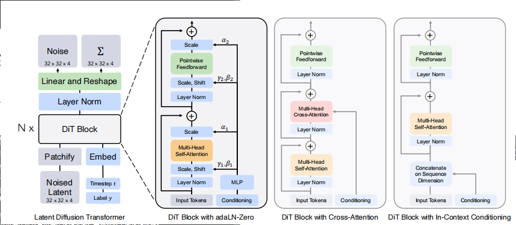
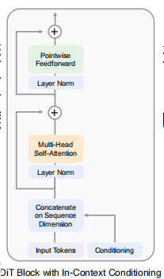
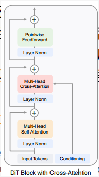
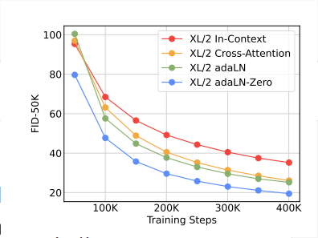

# Scalable Diffusion Models with Transformers

## 1. 前言

过去的五年，transformers在视觉，NLP等领域取得了巨大成功。同样在自回归领域，transformers得到了广泛使用，但是在其他生成领域使用较少。例如扩散模型的骨干网络依然使用的U-Net卷积网络。

本文我们提出了基于transformers的扩散模型，DiTs。DiTs继承了ViTs中的最佳实践。

## 2. Diffusion Transformers

### 2.1 Diffusion 公式推导

高斯扩散模型假设前向的在真实数据中$x_0$加噪过程表示为 $q(x_t|x_0) = N(x_t;\sqrt{\bar\alpha_t}x_0,(1-\bar\alpha_t)I)$

其中 $ \bar\alpha_t $ 为超参数。
将上式化简后，
$x_t = \sqrt{\bar\alpha_t}x_0 + \sqrt{1-\bar\alpha_t}\epsilon_t$.

扩散模型学习加噪的逆向过程
$p_\theta(x_{t-1}|x_t) = N(\mu_\theta(x_t), \sum_\theta(x_t))$, 神经网络用于学习 $p_\theta$ 。

损失函数为$x_0$的对数似然的变分下界：
 $L(\theta) = -p(x_0|x_1) + \sum_tD_{KL}(q^*(x_{t-1}|x_t, x_0)||p_\theta(x_{t-1}|x_t))$

 $q^*$ 和 $p_\theta$ 是高斯分布，$ D_{KL} $ 可以简化为求两个分布的均值和协方差。通过将 $\mu_\theta$ 重新参数化为噪声预测网络 $\epsilon_\theta$。因此模型可以被训练为预测噪音 $\epsilon_\theta(x_t)$跟基准噪音 $\epsilon_t$ 之间的均值方差
  $L_{simple}(\theta) = ||\epsilon_\theta(x_t) - \epsilon_t||_2^2$。
一旦 $p_\theta$被学习出来，新图片的生成，初始化为 $x_t \sim N(0,I)$, 采样过程为 $x_{t-1} \sim p_\theta(x_{t-1}|x_t)$

#### Classifier-free guidance

有限制条件的扩散模型会输入额外的信息，例如类别标签 $c$ .逆向过程变成了 $p_\theta(x_{t-1}|x_t,c)$, $\epsilon_\theta$ 和 $\sum_\theta$ 受限于条件c。classifier-free guidance 能够在采样过程中找到x，使得$logp(x)的值很大$。

#### Latent diffusion models

直接在高分辨率的像素空间中训练扩散模型计算量会非常大。LDM将这个问题划分为两个阶段：

* 利用自动编码器$E$将图像压缩成更小的空间表示
* 基于 $z = E(x)$ 训练扩散模型，而不是直接在$x$上训练。新图片的生成在得到 $z$ 之后，使用解码器 $D$ 将图片还原。

### 2.2 Diffusion Transformer架构设计

#### Patchify

DiT的输入是一个空间表示 $z$（ $256 \times 256 \times 3$ 图像，encode之后为  $32 \times 32 \times 4$。DiT的第一层是patchify，将空间输入转化为长度为T的token 序列。输入为$ I \times I \times C $ patchified 之后变为长度为T的序列。T的长度等于 $(I/p)^2$。

#### DiT block 设计

* In-context conditioning

将embedding 之后的t和c加入到输入中。

* Cross-attention block

将t和c扩充为2倍长度。Transformer block 在Multi-Head Self-Attention之后增加了一个 Multi-Head Cross-Attention。

* Adaptive layer norm block

我们不直接学习按照维度缩放和移动参数 $\gamma$ 和 $\beta$, 而是用embediing t 和 c 的和来回归得到 $\gamma$ 和 $\beta$。

* adaLN-Zero block
之前的工作发现ResNets中每一个残差模块使用相同的初始化函数是有益的。文章提出对DiT中的残差模块的参数γ、β、α进行衰减，以达到类似的目的。

#### 模型大小

与ViT类似，DiT有四个不同大小的模型，DiT-S，DiT-B，DiT-L，DiT-XL。

#### Transformer decoder

在最后一个DiT block之后，我们需要将图像token序列解码为噪音预测和对角协方差预测。
这两个输出与原始空间的输入形状一致，因此我们使用线性解码器来完成这个操作。
我应用final layer norm 和 线性解码，将每一个token 转换为 $p\times p \times 2c$ 的张量。c是DiT输入的通道数。最后我们将解码后的token进行重排列到原来的空间中，获取预测的噪音及协方差。

## 3.实验设置

### 训练

训练数据集为分辨率为 $256 \times 256$ 和 $512 \times 512$ 的ImageNet数据集。

最后一个线性层参数初始化为0，其他层参照ViT的策略。

优化算法为AdamW，学习率为 $1 \times 1o^{-4}$, 没有衰减设置， batch size 为256。仅有的数据增强为 horizon flips。

训练过程中的超参数为 model sizes 和 patch size。

### Diffusion

我们使用了来自Stable Diffusion预训练的自动编码器（VAE），VAE 编码器将$256 \times 256 \times 3$ RGB图像 转化为 $32 \times 32 \times 4$。 在采样结束后，使用 VAE 解码器将模型输出转化为图像。

### 评价指标

评价指标第一优先级为FID，第二优先级为sFID，Precision/Recall。FID越低表示模型精度越好。

## 4. 实验

### 不同DiT block对比实验

我们训练了四个DiT-XL/2 模型，每个模型采用不同的block设计，in-context, cross-attention, adaptive layer norm, adaLN-zero。
我们测量了不同设计下的FID， adaLN-Zero block 获得了最低的FID。adaLN-zero 将每个DiT block 初始化为恒等函数，其性能优于adaLN。

### 不同模型大小，不同patch size

模型增大，patch size 减小 能够显著改进FID的表现，获得更小的FID。

### Model compute VS Sampling Compute

与大多数生成模型不同，扩散模型的独特之处在于它们可以在训练后生成图片时，通过增加采样次数 来进行额外计算。测试发现，采样计算无法弥补模型计算的不足。
DiT L/2 使用了80.2Tflops对图像进行采样，DiT XL/2 使用了15.2Tflops，XL/2 的计算量减少了5倍，但是依然取得了更好的FID。
