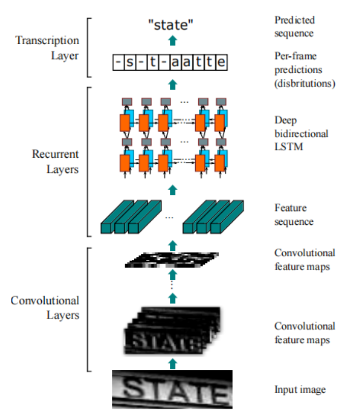
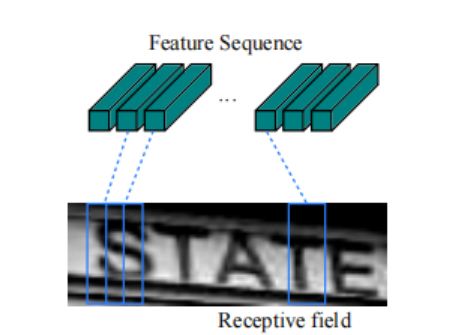
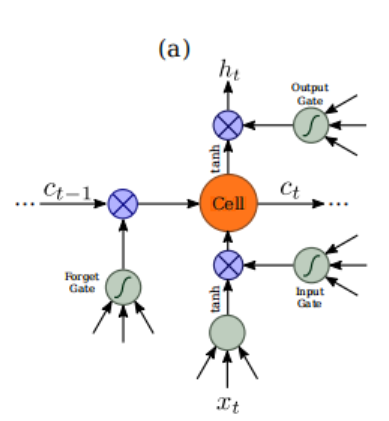
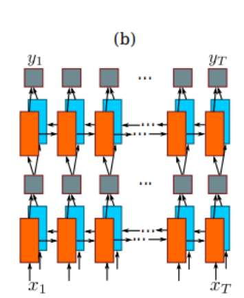
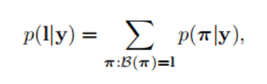

# An End-to-End Trainable Neural Network for Image-based Sequence

Recognition and Its Application to Scene Text Recognition

## 1. 介绍

本文的主要贡献是一种新颖的神经网络模型，其网络架构专门设计用于识别图像中类似序列的对象。

所提出的神经网络模型被命名为卷积循环神经网络（CRNN），因为它是DCNN和RNN的组合。

对于类似序列的对象，CRNN相对传统的神经网络模型具有几个显著的优点：

1）它可以直接从序列标签（例如单词）中学习，无需详细注释（例如字符）；

2）它具有与DCNN相同的性质，可以直接从图像数据中学习信息表示，无需手工制作特征或预处理步骤，包括二值化/分割、组件定位等；

3）它具有与RNN相同的属性，能够产生一系列标签；

4）它不受类似序列对象的长度约束，在训练和测试阶段仅需要高度归一化；

5）它在场景文本（单词识别）上实现了更好或非常具有竞争力的性能，优于[23，8]中的先前技术；

6）它包含比标准DCNN模型更少的参数，消耗更少的存储空间。

## 2. 网络架构

CRNN 网络结构如图所示，由三部分构成：

* 卷积层  卷积层自动从每个输入图像中提取特征。
* 循环层 卷积神经网络的顶部，建立了一个循环神经网络，用于对卷积层输出的每一帧特征序列进行预测。
* 转录层 CRNN的顶部是转录层，将循环层的逐帧输出转化为序列标签。

尽管CRNN由不同类型的网络架构（例如CNN和RNN）组成，但可以使用一个损失函数进行联合训练。

### 2.1 特征序列提取

在CRNN模型中，卷积层的组成部分是通过从标准CNN模型中取出卷积层和最大池化层（去除全连接层）构建而成的。这个组成部分用于从输入图像中提取顺序特征表示。

在输入到网络之前，所有图像需要被缩放到相同的高度。然后，从卷积层组件生成的特征图中提取一个特征向量序列，作为循环层的输入。

具体地，每个特征序列的特征向量是按照列从左到右在特征图上生成的。这意味着第i个特征向量是所有图的第i列的串联。在我们的设置中，每列的宽度固定为单个像素。

由于CNN需要将输入图像缩放到固定大小以满足其固定的输入尺寸，因此对于长度变化较大的序列对象来说并不合适。

在CRNN中，我们将深度特征传递到序列表示中，以使其对序列对象的长度变化具有不变性。

### 2.2 序列预测

在卷积网络之上建立了循环神经网络。

循环层为每个特征序列x = x1，...，xT预测标签分布yt。

循环层的优点有三个。

* 首先，RNN具有捕获序列中上下文信息的强大能力。在基于图像的序列识别中使用上下文线索比独立地处理每个token更稳定和有益。以场景文本识别为例，宽字符可能需要几个连续的帧才能完全描述（参见图2）。
* 此外，一些模糊的字符在观察其上下文时更容易区分，例如通过对比字符高度来识别“il”比单独识别每个字符更容易。 其次，RNN可以将误差差分反向传播到其输入，即卷积层，使我们能够在统一的网络中联合训练循环层和卷积层。
* RNN能够在任意长度的序列上操作，从开头遍历到结束。

传统的RNN单元存在梯度消失问题，这限制了它可以存储的上下文范围，并增加了训练过程的负担。
长短期记忆（LSTM）是一种专门设计来解决这个问题的RNN单元类型。

LSTM（如图3所示）由一个内存单元和三个乘法门组成，即输入门、输出门和遗忘门。

从概念上讲，内存单元存储过去的上下文，输入和输出门允许单元长时间存储上下文。

与此同时，遗忘门可以清除单元中的内存。LSTM的特殊设计使它能够捕获常出现于基于图像的序列中的长程依赖关系。

LSTM是单向的，它只使用过去的上下文信息。  
然而，在基于图像的序列中，来自两个方向的上下文信息都是有用且相互补充的。  
因此，我们采用[17]的方法，将一个正向LSTM和一个反向LSTM组合成一个双向LSTM。  
此外，多个双向LSTM可以堆叠在一起，形成深度双向LSTM，如图所示。

深度结构比浅层结构具有更高级别的抽象能力，在语音识别任务中取得了显著的性能改进。

深度结构允许比浅层结构更高级别的抽象，已经在语音识别任务中取得了显著的性能提升[17]。

在循环层中，误差微分沿着图所示箭头的相反方向进行传播，即时间反向传播（BPTT）。

在循环层的底部，传播的微分序列被连接成映射，翻转了将特征映射转换为特征序列的操作，并被反馈给卷积层。

在实践中，我们创建了一个名为“Map-to-Sequence”的自定义网络层，作为卷积层和循环层之间的桥梁。

### 2.3 转录

转录是将 RNN 的每帧预测转换为具有最高概率的条件标签序列的过程，其中有两种模式：无词典和基于词典。

#### 2.3.1 标签序列的概率

我们采用了Graves等人提出的CTC层定义的条件概率。

该概率针对标签序列l给定每帧预测y = y1，...，yT，并且它忽略了标签l中每个标签所在的位置。

因此，当我们使用该概率的负对数似然作为训练网络的目标时，我们只需要图像及其相应的标签序列，避免了标记单个字符位置的工作。

该条件概率的表述如下：输入是一个序列y = y1，...，yT，其中T为序列长度。每个 $y_t$ 是在L 上的概率分布。L包含所有的字符以及空格。

$\beta$ 函数将 $\pi$ 映射成为l，删除重复的字符和空格。例如 将“--hh-e-l-ll-oo--” 转化为 “hello”。  
因此条件概率定位为由 $\beta$ 映射到所有 $\pi$ 的和。

其中$\pi$的概率被定义为 $p(\pi|y) = \prod_{t=1}^{T}y_{\pi_t}^t$ ，其中$y_{\pi_t}^t$是在时间戳t上具有标签$\pi_t$的概率。

#### 2.3.2 无词典转录

在这种模式下，根据公式1定义的最高概率序列l被视为预测结果。由于不存在可行的精确解算法，因此我们采用[15]中采用的策略。该策略通过在每个时间戳t处选择最可能的标签πt，并将结果映射到l来近似找到最佳序列l*。

#### 2.3.3  基于词典转录

在基于词典的模式下，每个测试样本都与一个词典D相关联。基本上，通过选择在词典中具有最高条件概率（定义在公式1中）的序列来识别标签序列，即

然而，对于大型词典（例如包含50,000个单词的Hunspell拼写检查字典[1]），对词典进行穷举搜索即计算词典中所有序列的公式1并选择具有最高概率的序列将非常耗时。为了解决这个问题，我们观察到通过基于词典的自由转录方法预测的标签序列通常在编辑距离度量下接近于正确值。这表明我们可以将搜索限制为最近邻候选项Nδ(l0)，其中δ是最大编辑距离，l0是从基于词典的模式下从y转录出的序列：

### 2.4 网络训练

将训练数据集表示为 $X={I_i, l_i}$，其中 $I_i$ 表示训练图像，$l_i$ 表示实际标签序列。目标是最小化条件概率的负对数似然，即：

这个目标函数从图像和实际标签序列直接计算成本值，其中 yi 是由循环卷积层从 Ii 中生成的序列。因此，网络可以端到端地训练图像和序列对，消除了手动标记所有训练图像中各个组件的过程。

该网络使用随机梯度下降（SGD）进行训练。梯度是通过反向传播算法计算得出的。特别地，在转录层中，错误差分通过前向-后向算法进行反向传播，如文献[15]所述。在循环层中，采用"时域反向传播"(BPTT)算法来计算误差差分。

为了优化，我们使用ADADELTA [37]自动计算每个维度的学习率。与传统的动量[31]方法相比，ADADELTA不需要手动设置学习率。更重要的是，我们发现使用ADADELTA进行优化收敛速度比动量法快。

## 3. 实验

### 3.1 实现细节

我们在实验中使用的网络配置总结在表1中。卷积层的架构基于VGG-VeryDeep架构[32]。为了适合识别英文文本，进行了微调。在第3个和第4个最大池化层中，采用了1×2大小的矩形池化窗口，而不是传统的正方形窗口。这种微调产生了更宽的特征图，因此具有更长的特征序列。例如，包含10个字符的图像通常为100×32大小，从中可以生成一个25帧的特征序列。这个长度超过了大多数英语单词的长度。此外，矩形池化窗口产生矩形感受野（如图2所示），有助于识别一些形状较窄的字符，例如'i'和'l'。

该网络不仅具有深层卷积层，还具有循环层，这两者都被认为难以训练。我们发现批量归一化[19]技术对于训练如此深度的网络非常有用。在第5个和第6个卷积层之后分别插入了两个批量归一化层。通过批量归一化层，训练过程大大加速。

## 4. 结论

本论文提出了一种新颖的神经网络架构，称为卷积循环神经网络（CRNN），它融合了卷积神经网络（CNN）和循环神经网络（RNN）的优点。CRNN能够接受大小不同的输入图像，并产生不同长度的预测结果。它直接运行于粗略级别的标签（例如单词），在训练阶段不需要为每个单独元素（例如字符）提供详细注释。此外，由于CRNN放弃了传统神经网络中使用的全连接层，因此产生了更紧凑、更高效的模型。所有这些特性使得CRNN成为基于图像的序列识别的优秀方法。在场景文本识别基准测试上进行的实验表明，与传统方法以及其他基于CNN和RNN的算法相比，CRNN取得了优越或高度竞争的性能。这证实了所提出算法的优势。此外，CRNN在光学乐谱识别（OMR）基准测试中显著优于其他竞争对手，验证了CRNN的通用性。事实上，CRNN是一个通用的框架，因此它可以应用于其他涉及图像序列预测的领域和问题（例如汉字识别）。
