# Real-time Scene Text Detection with Differentiable Binarization

## 1.背景介绍

作为场景文本阅读的关键组成部分，场景文本检测旨在定位每个文本实例的边界框或区域。

场景文本通常具有不同的尺度和形状包括水平、多方向和曲线文本。

基于分割的场景文本检测近年来受到了广泛关注，因为它可以描述各种形状的文本，并从像素级预测结果中获益。

然而，大多数基于分割的方法需要进行复杂的后处理， 将像素级预测结果分组成检测到的文本实例，在推理过程中产生相当的时间成本。

以最近的两种场景文本检测技术为例：PSENet（Wang等人，2019）提出了渐进式尺度扩展的后处理方法，以提高检测精度；

Pixel embedding（Tian等人，2019）用于基于分割结果对像素进行聚类，其中必须计算像素之间的特征距离。

大多数现有的检测方法如图蓝色箭头所示：

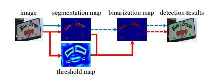

首先设置一个固定的阈值，将分割网络产生的概率图像转换为二值图像，然后使用启发式技术，例如像素聚合，将像素分组成文本实例。

本文提出的方法，如红色箭头所示，把二值化操作插入到分割网络中进行联合优化，这样可以自适应的预测每个位置的阈值的值,能够完全充分区分前景
和背景图像。标准的二值化操作无法微分，本文提出了一种近似的可微分二值化函数，称为Differentiable Binarization（DB），它可以和分割网络一起训练，完全可微分。

本文的主要贡献是提出了一个可微分的DB模块，是的卷积神经网络的二值化过程能够端对端的进行训练。通过将简单的语义分割网络和提出的DB模块进行结合，本文提出了一种鲁棒性强而且
快速的场景文字检测器。主要有以下几个优势：

* 在基准数据集上实现了始终如一的性能，包括水平，多方向和曲线文本。
* 比之前的SOTA方法快，因为DB提供了高度鲁棒的二值化图，简化了后处理过程。
* 使用轻量级骨干网络ResNet-18， 显著提高了检测性能。
* 由于DB可以在推理阶段删除而不会损失性能，没有额外的内存 时间成本。

## 2. 相关工作

最近的场景文本检测分为两类，基于回归和基于分割。

基于回归是直接回归文本实例的边界框。

基于分割将像素级预测和后处理算法结合起来得到边框。

## 3. 方法
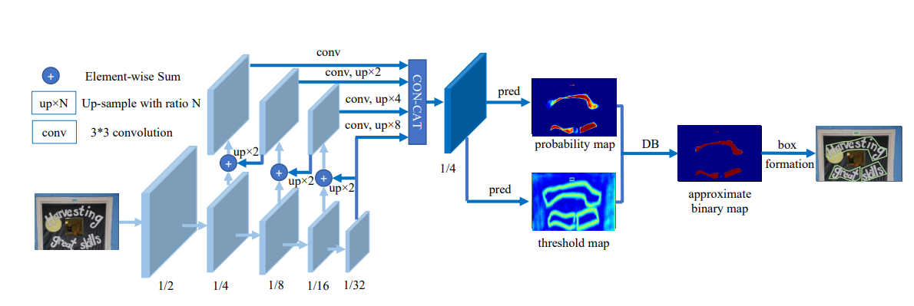

本文提出的方法架构如图所示，输入图像进入特征金字塔骨干网络，然后，金字塔特征上采样到相同的尺度并级联产生特征F。
用特征F预测probability map （P） 和 threshold map（T）。之后通过P和F计算 approximate binary map （B）。

在训练期间，权重更新应用于probability map 、 threshold map 和 approximate binary map。其中probability map 和 threshold map 共享相同的权重。

推理期间，文字边框可以从 approximate binary map 或者 probability map 计算出来。

### 3.1 二值化

#### 标准二值化

给定一个由分割网络生成的probability map  $P \in R^{H \times W}$，当像素值为1的时候，视作文本。二值化操作过程可以通过下面的公式表述。

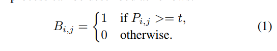

其中t为阈值。

#### 可微分二值化

标准二值化无法微分，不能在训练分割网络过程中优化。为了解决这个问题，提出了下面的二值化函数
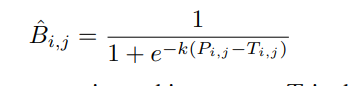

B 是 approximate binary map，T是从网络中学习的自适应阈值图，k是放大因子，经验值为50。该式与标准二值化函数类似，区别在于它能够在训练过程中
通过分割网络进行优化。

通过可微分化二值函数和自适应阈值，可以更好的区分文本区域与背景，同时将紧密连接的文本实例分开。

DB之所以能够提升精度可以通过梯度下降来解释。

DB function 为 $f(x)= \frac{1}{1+e^{-kx}}$, $x=P_{i,j} - T_{i,j}$. 然后正样本和负样本的损失函数如下：

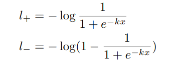

上式的微分如下：

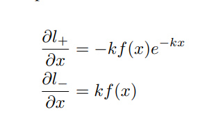

从这个微分中可以看出以下几点：

（1）梯度通过放大因子k进行增强；

（2）对于大多数错误预测区域（L+的x < 0；L-的x > 0），梯度的放大非常显著，从而促进了优化并有助于产生更具有区分度的预测。

此外，由于x = Pi,j - Ti,j，P的梯度受到T的影响和重新缩放，在前景和背景之间得到了调整。

### 3.2 自适应阈值

threshold map 和 文本边框在外观上相似。但是probability map 和 文本边框 动机与用途不同。  
我们的threshold map 用于二值化的阈值。

### 3.3 可变性卷积
可变性卷积可以为模型提供灵活的感受野，这对于具有极端宽高比的文本实例尤其有益。

根据（Zhu et al. 2019）的方法，在ResNet-18或ResNet-50主干网络中的conv3、conv4和conv5阶段的所有3×3卷积层中应用调制可变形卷积。

### 3.4 标签生成

给定y一个文本图像，文本区域的多边形都由一组线段描述，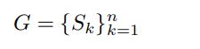n表示顶点数。不同的数据集下，顶点数不一样。

然后使用ti剪辑算法，将多边形G缩小到Gs，从而生成正面积。收缩的偏移量，可以通过原始的多边形的周长L和面积A计算出来
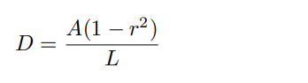，r是收缩比，经验值为0.4。

使用类似的过程，我们可以为阈值图生成标签。首先，将文本多边形G用相同的偏移量D膨胀到Gd。

我们认为Gs和Gd之间的间隙是文本区域的边界，阈值图的标签可以通过计算到最近线段的距离来生成。

### 3.5 优化
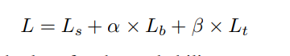

损失函数L可以表示为概率图的损失函数Ls、二进制图的损失函数Lb和阈值图的损失函数Lt加权和。  
其中，Ls是概率图的损失函数，Lb是二进制图的损失函数。根据损失函数的数值，设置α为1.0，β为10。

我们对Ls和Lb都应用了二元交叉熵（BCE）损失函数。为了克服正负样本数量不平衡的问题，在BCE损失函数中采用了困难负样本挖掘技术，通过对困难负样本进行采样来处理这个问题。
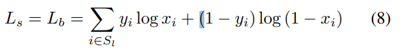

Sl是采样集，其中正负样本的比例为1：3。

Lt计算为扩张的文本多边形Gd内预测值和标签之间L1距离的总和：
其中Rd是扩张的多边形Gd内像素的索引集合；y∗是阈值图的标签。

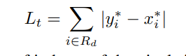

在推理期间，我们可以使用概率映射或近似二进制映射来生成文本边界框，这几乎产生相同的结果。为了更好地提高效率，我们使用概率映射以便可以删除阈值分支。框形成过程包括三个步骤：（1）首先使用常量阈值（0.2）对概率映射/近似二进制映射进行二值化，以获取二进制映射；（2）从二进制映射中获取连通区域（缩小的文本区域）；（3）使用偏移量D0膨胀缩小区域，采用Vatti剪裁算法（Vati 1992）。D0是通过以下公式计算得出的：
D0 = A0 × r0 / L0（10）
其中A0是缩小多边形的面积；L0是缩小多边形的周长；r0根据经验设置为1.5。

## 4. 实验
 实验结果如图所示

 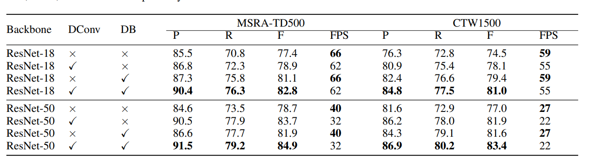

### 4.1 实现细节
对于所有模型，我们首先使用SynthText数据集进行100k次迭代的预训练。

然后，我们在相应的真实世界数据集上进行1200个时期的微调。训练批量大小设置为16。

我们遵循poly学习率策略，其中当前迭代的学习率等于初始学习率乘以(1-iter/max iter)^power，其中初始学习率设置为0.007，power为0.9。我们使用0.0001的权重衰减和0.9的动量。

max iter表示最大迭代次数，这取决于最大epoch数。

训练数据的数据增强包括：

(1) 随机旋转，角度范围为(-10度，10度)；

(2)随机裁剪；

(3)随机翻转。

所有处理过的图像都被重新调整为640×640，以提高训练效率

在推理期间，我们保持测试图像的纵横比，并通过为每个数据集设置适当的高度来重新调整输入图像的大小。  
使用单个1080ti GPU和单个线程，以批量大小1测试推理速度。
推理时间成本包括模型前向时间成本和后处理时间成本。后处理时间成本约占推理时间的30%。

### 4.2 消融实验

#### 可微二值化方法

我们可以看到我们提出的可微二值化方法（Differentiable binarization）显著提高了ResNet-18和ResNet-50在两个数据集上的性能。

对于ResNet-18骨干网络，在MSRA-TD500数据集和CTW1500数据集上，DB在F-measure指标上分别实现了3.7％和4.9％的性能提升。

对于ResNet-50骨干网络，DB分别带来了3.2％（在MSRA-TD500数据集上）和4.6％（在CTW1500数据集上）的提高。

此外，由于DB可以在推理期间移除，所以与没有DB的速度相同。

#### 可变形卷积

变形卷积（Deformable convolution）还可以带来1.5％至5.0％的性能提升，因为它为骨干网络提供了灵活的感受野，并具有较小的额外时间成本。

对于MSRA-TD500数据集，使用可变形卷积可以使F-measure指标分别提高1.5％（使用ResNet-18）和5.0％（使用ResNet-50）。

对于CTW1500数据集，可变形卷积带来了3.6％（使用ResNet-18）和4.9％（使用ResNet-50）的提高。

#### 是否使用监督

尽管具有/不具有监督的阈值图在外观上相似，但监督可以提高性能。  

如表2所示，在MLT-2017数据集上，监督可以使性能分别提高0.7％（使用ResNet-18）和2.6％（使用ResNet-50）。

#### backbone 不同

使用ResNet-50骨干网络的提出的检测器比ResNet-18在性能上表现更好，但运行速度较慢。

具体而言，在MSRA-TD500数据集和CTW1500数据集上，最佳的ResNet-50模型分别比最佳的ResNet-18模型提高了2.1％和2.4％的性能，在时间成本大约翻倍的情况下。

## 5. 结论

本文提出了一种新的检测任意形状场景文本的框架，其中包括在分割网络中提出的可微二值化过程（DB）。

实验验证了我们的方法（使用ResNet-50骨干网络）在速度和准确性方面始终优于五个标准场景文本基准上的最先进方法。

特别地，即使使用轻量级骨干网络（ResNet-18），我们的方法也可以在所有测试数据集上实现有竞争力的性能，并且具有实时推理速度。